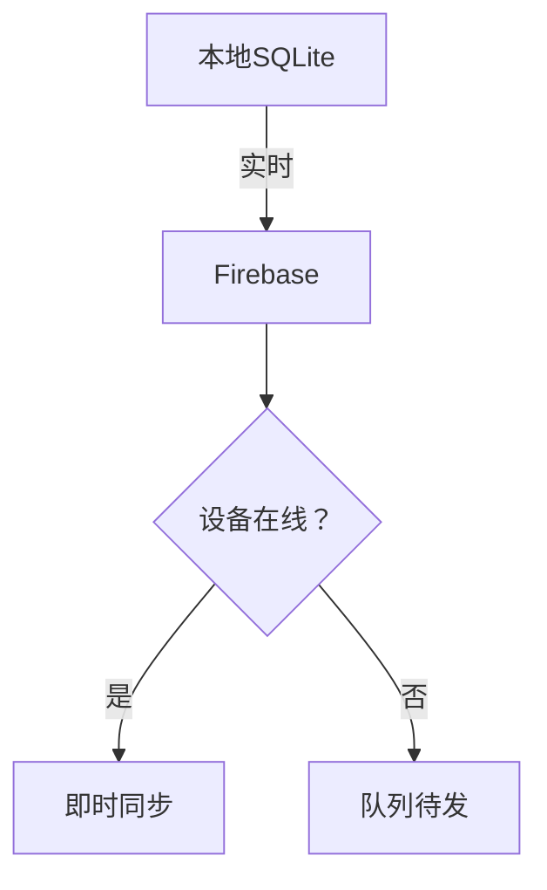
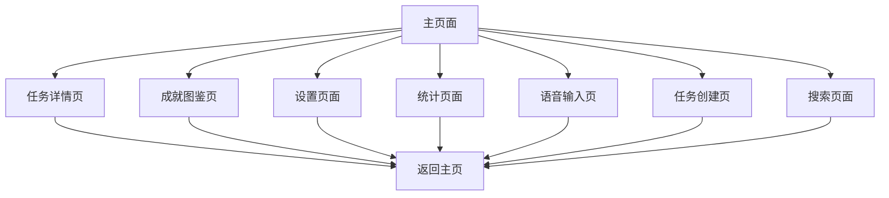
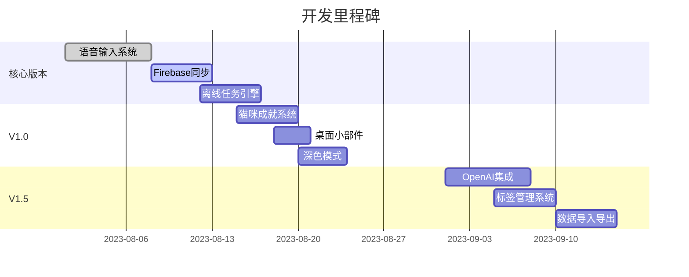

# 🐱 Egg - 产品设计文档

## 📋 产品概述

**产品名称**: Egg计划工具 (CatTask)  
**产品定位**: 原生安卓AI任务管理 + 离线语音输入 + 跨设备同步  
**核心价值**: 帮助用户通过语音输入快速整理每日计划，由AI自动生成清晰的ToDo清单，并智能选出最重要的三个事情，用可爱的猫咪卡片形式呈现，提升效率和成就感。

---

## 🎯 目标用户分析

| 用户类型       | 核心痛点                  | 本方案解决             |  
|----------------|--------------------------|-----------------------|  
| **通勤上班族** | 开车时无法打字记录任务    | 方向盘操控模式 + 驾驶模式语音增强 |  
| **学生党**     | 多设备（手机/平板）切换   | 实时Firebase同步 + 课表智能关联 |  
| **自由职业者** | 低网络环境（如咖啡馆）    | 纯离线任务管理 + 网络恢复自动同步 |  

---

## 🚀 核心功能设计

### 1. 语音输入系统

#### 1.1 基础语音功能
- **60秒长语音支持**: 分段录音 + 静音检测拼接
- **暂停/继续控制**: 三态按钮（录音中 → 暂停 → 结束）
- **驾驶模式特化**: 降低语音触发阈值（200ms → 50ms）

#### 1.2 错误修正系统
1. **点击编辑**: 点击错误文本直接编辑
2. **长按重录**: 长按片段重新录音
3. **AI智能建议**: 本地优先的智能纠错
4. **语音指令**: "删除最后一句"等语音控制

### 2. AI智能处理

#### 2.1 任务识别引擎
- **当前版本**: 离线规则引擎（10种基础类型）
- **未来扩展**: OpenAI API集成（用户自填Key）
- **任务类型**: 工作、学习、运动、购物、会议、个人、健康、旅行、烹饪、清洁

#### 2.2 Top3智能选择
- **时间关键词**: "紧急"、"9点前"、"今天"
- **优先级分析**: 历史任务优先级学习
- **用户习惯**: 个性化任务重要性判断

### 3. 界面设计系统

#### 3.1 视觉主题
- **森林背景**: 伪3D视差滚动（三层静态图）
- **毛玻璃卡片**: 透明质感，边缘圆润
- **猫咪主题**: 可爱插画 + 动态效果

#### 3.2 交互效果
- **完成任务动画**: Lottie微动效（跳跃+粒子特效）
- **语音按钮**: 脉冲动画 + 状态反馈
- **卡片悬停**: 阴影效果 + 轻微缩放

#### 3.3 深色模式
- **自动切换**: 基于日出日落时间
- **手动切换**: 用户强制控制
- **护眼配色**: 深绿(#0A2F23) + 暗金(#D4AF37)

### 4. 数据同步策略

#### 4.1 核心架构

#### 4.2 数据管理
- **导出格式**: CSV（Excel兼容）
- **导入功能**: V2.0支持（防冲突校验）
- **冲突解决**: 时间戳优先策略

### 5. 成就系统

#### 5.1 猫咪图鉴体系
| 成就条件              | 奖励              | 特效 |
|-----------------------|-------------------|------|
| 单日完成Top3任务      | 基础猫咪卡        | 无 |
| 连续3天完成所有任务   | 银边动态猫        | 银光 |
| 连续7天完成Top3       | 金光特效猫        | 金光 |
| 收集20张卡            | 限定隐藏猫        | 彩虹 |

#### 5.2 社交激励
- **成就海报**: 自动生成分享图片
- **进度展示**: 收集进度条
- **里程碑**: 阶段性成就解锁

---

## 📱 页面架构设计

### 主要页面清单

#### 1. 主页面 (MainScreen)
- **用途**: 任务展示、语音输入、快速操作
- **核心功能**: 
  - 任务列表展示（Top3 + 所有任务）
  - 语音输入界面
  - 实时统计信息
  - 快速任务操作（完成、删除、标记重要）

#### 2. 任务详情页 (TaskDetailScreen)
- **用途**: 任务详细信息查看和编辑
- **核心功能**:
  - 任务内容编辑
  - 标签管理
  - 时间设置
  - 优先级调整
  - 任务历史记录

#### 3. 成就图鉴页 (AchievementScreen)
- **用途**: 猫咪收集图鉴展示
- **核心功能**:
  - 图鉴浏览
  - 成就解锁状态
  - 收集进度展示
  - 分享功能
  - 成就海报生成

#### 4. 设置页面 (SettingsScreen)
- **用途**: 应用配置和个性化设置
- **核心功能**:
  - 主题切换（浅色/深色/自动）
  - 同步设置（Firebase配置）
  - 语音配置（识别语言、灵敏度）
  - 通知设置
  - 数据管理（导出/导入）

#### 5. 统计页面 (StatisticsScreen)
- **用途**: 任务完成情况统计
- **核心功能**:
  - 图表展示（日/周/月完成趋势）
  - 任务类型分析
  - 完成率统计
  - 数据导出功能
  - 个人成就回顾

#### 6. 语音输入页 (VoiceInputScreen)
- **用途**: 专注的语音输入界面
- **核心功能**:
  - 大尺寸语音按钮
  - 实时语音转文字显示
  - 语音控制指令
  - 错误修正界面
  - 驾驶模式优化

#### 7. 任务创建页 (CreateTaskScreen)
- **用途**: 手动创建和编辑任务
- **核心功能**:
  - 任务内容输入
  - 类型选择
  - 优先级设置
  - 时间安排
  - 标签添加

#### 8. 搜索页面 (SearchScreen)
- **用途**: 任务搜索和筛选
- **核心功能**:
  - 关键词搜索
  - 标签筛选
  - 时间范围筛选
  - 状态筛选（完成/未完成）
  - 搜索结果展示

### 页面导航结构

### 页面交互流程

#### 主要用户流程
1. **启动应用** → 主页面
2. **语音输入** → 语音输入页 → 返回主页
3. **查看任务** → 任务详情页 → 返回主页
4. **创建任务** → 任务创建页 → 返回主页
5. **查看成就** → 成就图鉴页 → 返回主页
6. **搜索任务** → 搜索页面 → 返回主页
7. **查看统计** → 统计页面 → 返回主页
8. **设置配置** → 设置页面 → 返回主页

---

## 🔧 技术实现方案

### 开发路线图

### 扩展功能排期

| 功能                | 必要性 | 版本   | 方案概要 |
|---------------------|--------|--------|----------|
| **桌面小部件**      | 高     | V1.0   | 2×2/4×2尺寸，显示今日Top3任务 |
| **任务提醒**        | 高     | V1.0   | 基于时间+地理位置提醒 |
| **标签管理**        | 中     | V1.5   | #工作/#学习标签系统 |
| **语音指令扩展**    | 低     | V2.0   | 自然语言任务解析 |

---

## 🎨 UI设计规范

### 色彩系统
- **主色调**: 森林绿 (#2D5016)
- **强调色**: 猫咪橙 (#FF6B35)
- **辅助色**: 猫咪蓝 (#4ECDC4)
- **成就色**: 金色 (#FFD700)

### 字体规范
- **标题**: 24sp, Bold
- **正文**: 16sp, Regular
- **说明**: 14sp, Light
- **标签**: 12sp, Medium

### 间距系统
- **基础间距**: 8dp
- **卡片内边距**: 16dp
- **页面边距**: 16dp
- **组件间距**: 12dp

---

## 📊 成功指标

### 用户指标
- **日活跃用户**: 目标1000+
- **语音使用率**: 目标60%+
- **任务完成率**: 目标70%+
- **用户留存率**: 7日留存目标40%+

### 技术指标
- **语音识别准确率**: 目标90%+
- **同步成功率**: 目标99%+
- **应用启动时间**: 目标<3秒
- **离线功能可用性**: 目标100%

---

## 🔄 迭代计划

### V1.0 MVP版本
- 基础语音输入
- 任务管理核心功能
- 猫咪主题界面
- 本地数据存储

### V1.5 增强版本
- Firebase同步
- 成就系统
- 深色模式
- 桌面小部件

### V2.0 智能版本
- OpenAI集成
- 个性化推荐
- 高级统计分析
- 社交功能

---

**文档版本**: V1.0  
**最后更新**: 2025年7月  
**负责人**: Egg